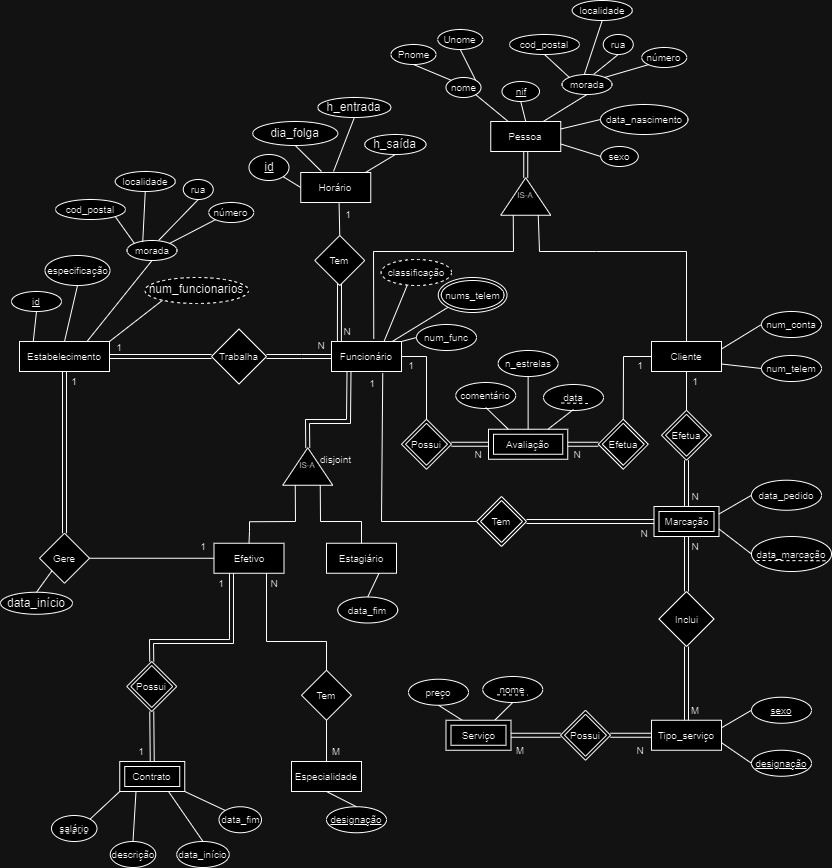
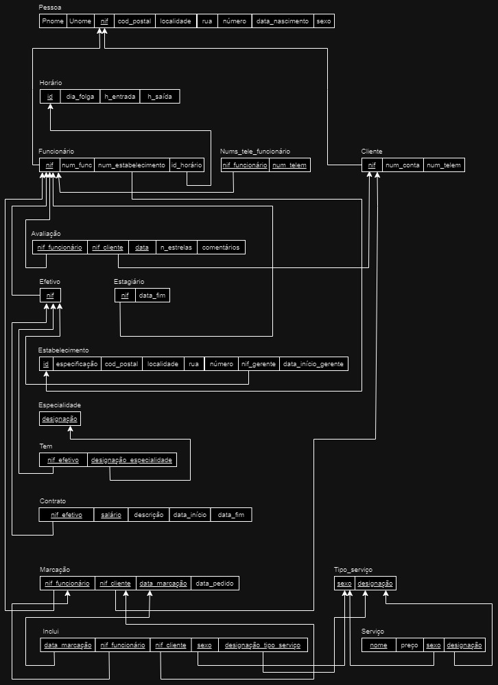

# BD: Trabalho Prático APFE

**Grupo**: P5G2
- Danilo Micael Gregório Silva, MEC: 113384
- Tomás Santos Fernandes, MEC: 112981

## Introdução / Introduction
 
No âmbito da cadeira Bases de Dados, foi nos proposta a realização de uma base de dados relacional para determinado serviço/aplicação ao nosso critério. 
Para tal, escolhemos abordar um tema que nos motivou pela sua constante e cada vez maior evolução nos dias de hoje:  Cabeleireiros/Barbeiros. Deste modo, o nosso trabalho consiste na criaçáo de uma base de dados com o objetivo de gerir todas as informações de uma empresa chamada Stylist Company, que possui uma grande rede de cabeleireiros e barbeiros espalhados por todo o país.
De facto, com o aumento da demanda por serviços de beleza e cuidados pessoais, especialmente os desta empresa, que está a crescer muito de ano para ano, torna-se crucial a adoção de sistemas de gestão eficazes, de modo a otimizar as suas operações e oferecer um serviço de qualidade aos seus clientes. Com isto, o nosso projeto, base de dados StylistData, é visto como uma possível solução à empresa Stylist Company, permitindo a gestão de estabelecimentos, funcionários, clientes e marcações efetuadas pelos mesmos.

## ​Análise de Requisitos / Requirements

### Identificação das entidades

#### Pessoa 
Uma Pessoa é um Funcionário ou um Cliente. Define-se com um nome (constituído pelo primeiro e último nome), NIF, morada (composta pelo código postal, localidade, rua e número), data de nascimento e sexo. 

#### Funcionário
Um Funcionário representa um trabalhador da empresa. Sendo uma Pessoa, cada um é caracterizado por cada um dos atributos dessa entidade, e ainda por um número de trabalhador/funcionário e por dois números de telemóvel: um privado e um profissional, fornecido para contacto com os clientes. Além disto, um Funcionário possui ainda uma classificação, que é resultado da média de todas as avaliações que recebe (derivado). Um Funcionário ou é Estagiário ou é Efetivo na empresa. 

#### Estagiário
Um Estagiário representa um Funcionário que terminou recentemente a sua formação e entrou para a empresa para adquirir alguma experiência. Além de ser definido pelos atributos herdados de Pessoa e Funcionário, define-se ainda por uma data de fim de estágio, momento em que poderá ir embora ou tornar-se efetivo.

#### Efetivo
Já a entidade Efetivo representa um Funcionário que se tornou efetivo, isto é, que assinou contrato com a empresa. É identificado pelos mesmos atributos de Pessoa e Funcionário, e pode possuir uma especialidade. Um Funcionário Efetivo pode ser gestor de um estabelecimento.

#### Contrato
O Contrato é tudo aquilo que define o acordo formal entre um Funcionário Efetivo e a empresa, estabelecendo os termos e condições do emprego. Assim, caracteriza-se por um salário associado, uma descrição e uma data de início e data de fim.

#### Especialidade
Um Funcionário pode possuir uma Especialidade, que tem uma designação que a caracteriza.

#### Estabelecimento
Um Estabelecimento representa um espaço físico da empresa, caracterizado por um id (um número único entre todos os estabelecimentos da empresa), uma especificação (visto que pode ser barbeiro ou cabeleireiro), uma morada (composta pelo código postal, localidade, rua e número) e ainda por um número de funcionários, que poderá ser obtido através de todos os funcionários que trabalhem para um estabelecimento (derivado).

#### Horário
A entidade Horário é aquilo identifica os dias e horas de trabalho de um Funcionário num Estabelecimento. Sendo caracterizado por um identificador, pelo dia de folga, pela hora de entrada e pela hora de saída.

#### Cliente
Um Cliente é quem usufrui dos serviços da empresa e, para além dos atributos de Pessoa, é definido por um número de conta e por um número de telemóvel.

#### Avaliação
A entidade Avaliação refere-se a uma avaliação que um Cliente atribui a um Funcionário consoante a qualidade do seu serviço. Caracteriza-se por uma classificação numérica (número de estrelas), um comentário (opcional) e uma data (e hora) de criação.

#### Marcação
Uma Marcação é algo que um Cliente pode fazer, e define-se pela data em que foi realizada e pela data para a qual ficou marcada.

#### Tipo De Serviço
Um Tipo De Serviço está incluído numa Marcação e divide os serviços em várias zonas do corpo. Por exemplo, existem serviços para Cabelo, Barba, Sobrancelhas, Pele, etc. Então, caracteriza-se por uma designação, e distingue o sexo, visto que os serviços são disponibilizados para homem e mulher, e que existem serviços diferentes consoante o sexo.

#### Serviço 
Um Serviço é aquilo que realmente vai ser feito, dentro do Tipo De Serviço especificado. É, assim, definido por um nome e um preço. Por exemplo, dentro do Tipo De Serviço Cabelo, pode existir Corte Curto, Pintar Cabelo Longo, etc.

### Identificação das relações entre entidades e respetiva cardinalidade:
#### -> Funcionário tem Horário (N:1)
#### -> Funcionário trabalha para Estabelecimento (N:1)
#### -> Efetivo possui Contrato (1:1)
#### -> Efetivo tem Especialidade (N:M)
#### -> Efetivo gere Estabelecimento (1:1)
#### -> Cliente efetua Avaliação (1:N)
#### -> Funcionário possui Avaliação (1:N)
#### -> Cliente efetua Marcação (1:N)
#### -> Funcionário tem Marcação (1:N)
#### -> Marcação inclui Tipo De Serviço (N:M)
#### -> Tipo De Serviço possui Serviço (N:M)

### Identificação das obrigatoriedades
#### -> Uma Pessoa é obrigatoriamente um Funcionário ou um Cliente (podendo ser os dois).
#### -> Um Funcionário é obrigatoriamente ou um Efetivo ou um Estagiário (disjunto).
#### -> Todo o Funcionário que é Efetivo possui obrigatoriamente um Contrato. / Um Contrato existente tem de estar obrigatoriamente associado a um Funcionário Efetivo.
#### -> Nem todos os Funcionários Efetivos têm uma Especialidade. / Nem todas as Especialidades estão relacionadas com um Efetivo. 
#### -> Um Funcionário trabalha sempre para um Estabelecimento. / Um Estabelecimento tem, pelo menos, um Funcionário.
#### -> Todo o Funcionário tem um Horário. / Um Horário pode não estar associado a algum Funcionário.
#### -> Todos os Estabelecimentos são obrigatoriamente geridos por um Funcionário Efetivo. / Nem todos os Funcionários Efetivos gerem um Estabelecimento.
#### -> Nem todos os Clientes efetuam uma Avaliação a um Funcionário. / Todas as Avaliações são feitas por Clientes.
#### -> Uma Avaliação é sempre relacionada a um Funcionário. / Nem todos os Funcionários possuem Avaliações.
#### -> Todas as Marcações são efetuadas por Clientes. / Nem todos os Clientes efetuam Marcações (i.e., podem só ter conta Cliente).
#### -> Uma Marcação tem de estar associada a um Funcionário. / Um Funcionário pode não ter Marcações.
#### -> Todos os Tipos De Serviços têm algum Serviço associado. / Todos os Serviços fazem parte de algum Tipo De Serviço. 

### Funcionalidades

#### Utilizador (ponto de vista de um Cliente):
- Adicionar conta cliente;
- Agendar/Modificar/Cancelar marcação;
- Procurar estabelecimentos e respetivas informações;
- Ver informação e avaliação de um funcionário;
- Criar uma avaliação a um funcionário;
- Ver serviços disponíveis e respetivo preço.

#### Utilizador (ponto de vista de um Funcionário):
- Ver as suas marcações;
- Ver as respetivas avaliações.

#### Administrador
- Inserir/Editar/Remover dados de funcionários;
- Inserir/Editar/Remover dados sobre estabelecimentos;
- Inserir/Editar/Remover dados sobre serviços.
- Inserir/Editar/Remover dados de horários;
- Inserir/Editar/Remover especialidades.

## DER

## ER

 